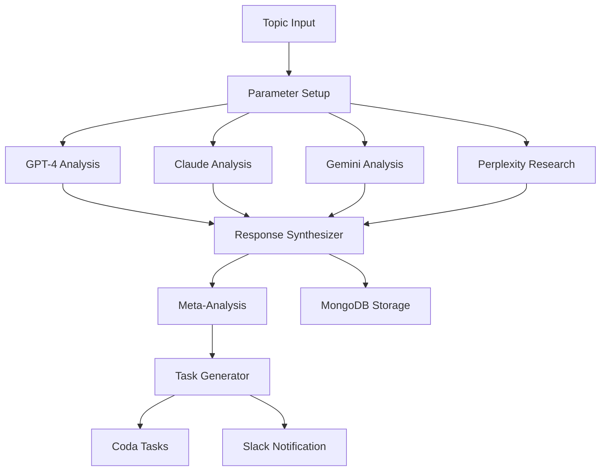

# n8n AI Collaboration Workflow - Implementation Guide

## Workflow Overview

This n8n workflow orchestrates multiple AI models (GPT-4, Claude, Gemini, Perplexity) to collaborate on analyzing topics, generating consensus insights, and creating actionable tasks automatically.

## Architecture



## Setup Instructions

### 1. Deploy n8n

```bash
# Docker deployment
docker run -d \
  --name n8n \
  -p 5678:5678 \
  -e N8N_BASIC_AUTH_ACTIVE=true \
  -e N8N_BASIC_AUTH_USER=admin \
  -e N8N_BASIC_AUTH_PASSWORD=your-password \
  -e N8N_ENCRYPTION_KEY=your-encryption-key \
  -v n8n_data:/home/node/.n8n \
  -v /local/files:/files \
  n8nio/n8n

# Or using Docker Compose
```

**docker-compose.yml:**
```yaml
version: '3.8'

services:
  n8n:
    image: n8nio/n8n
    container_name: n8n-ai-collaboration
    restart: always
    ports:
      - "5678:5678"
    environment:
      - N8N_BASIC_AUTH_ACTIVE=true
      - N8N_BASIC_AUTH_USER=admin
      - N8N_BASIC_AUTH_PASSWORD=${N8N_PASSWORD}
      - N8N_ENCRYPTION_KEY=${N8N_ENCRYPTION_KEY}
      - N8N_HOST=ai-collab.integratewise.com
      - N8N_PORT=5678
      - N8N_PROTOCOL=https
      - NODE_ENV=production
      - WEBHOOK_URL=https://ai-collab.integratewise.com/
    volumes:
      - n8n_data:/home/node/.n8n
      - ./backups:/backups
    networks:
      - n8n-network

  postgres:
    image: postgres:15
    container_name: n8n-postgres
    restart: always
    environment:
      - POSTGRES_USER=n8n
      - POSTGRES_PASSWORD=${POSTGRES_PASSWORD}
      - POSTGRES_DB=n8n
    volumes:
      - postgres_data:/var/lib/postgresql/data
    networks:
      - n8n-network

  redis:
    image: redis:7-alpine
    container_name: n8n-redis
    restart: always
    networks:
      - n8n-network

volumes:
  n8n_data:
  postgres_data:

networks:
  n8n-network:
```

### 2. Configure API Credentials

Access n8n at `http://localhost:5678` and add credentials:

#### OpenAI (GPT-4)
1. Go to Credentials → New → OpenAI
2. Add API Key from [platform.openai.com](https://platform.openai.com)
3. Name: "OpenAI API"

#### Anthropic (Claude)
1. Go to Credentials → New → Anthropic
2. Add API Key from [console.anthropic.com](https://console.anthropic.com)
3. Name: "Anthropic API"

#### Google Gemini
1. Create custom HTTP credential
2. Add header: `X-API-Key: YOUR_GEMINI_KEY`
3. Get key from [makersuite.google.com](https://makersuite.google.com)

#### Perplexity
1. Create custom HTTP credential
2. Add header: `Authorization: Bearer YOUR_PERPLEXITY_KEY`
3. Get key from [perplexity.ai/settings/api](https://perplexity.ai/settings/api)

#### Coda
1. Go to Credentials → New → Coda
2. Add API Token from Coda account settings
3. Add Document ID

#### Slack
1. Create Incoming Webhook
2. Add webhook URL to credentials

### 3. Import Workflow

1. In n8n, click "Workflows" → "Import"
2. Upload `n8n-ai-collaboration-workflow.json`
3. Update node credentials with your saved credentials

### 4. Configure Triggers

#### Schedule Trigger (Daily Analysis)
- Default: Daily at 9 AM
- Modify in node settings as needed

#### Webhook Trigger (On-Demand)
- Webhook URL: `https://your-n8n-instance/webhook/ai-collaborate`
- Test with:
```bash
curl -X POST https://your-n8n-instance/webhook/ai-collaborate \
  -H "Content-Type: application/json" \
  -d '{
    "topic": "How to reduce customer churn in SaaS",
    "context": "B2B enterprise software",
    "depth": "comprehensive"
  }'
```

## Usage Examples

### Example 1: Customer Retention Analysis

**Input:**
```json
{
  "topic": "Strategies to improve customer retention for enterprise SaaS",
  "context": "IntegrateWise CSM operations with 50+ accounts",
  "depth": "comprehensive"
}
```

**AI Responses Generated:**
- **GPT-4**: Strategic framework with implementation steps
- **Claude**: Human-centered approach with ethical considerations
- **Gemini**: Data-driven benchmarks and metrics
- **Perplexity**: Current market research and case studies

**Synthesized Output:**
```json
{
  "consensus_points": [
    {
      "point": "Implement proactive health scoring",
      "agreement_level": 4,
      "strength": "strong"
    },
    {
      "point": "Establish QBR cadence",
      "agreement_level": 3,
      "strength": "strong"
    }
  ],
  "action_items": [
    {
      "title": "Deploy Health Score System",
      "priority": "high",
      "due_date": "2024-12-01",
      "assigned_to": "founder"
    },
    {
      "title": "Create QBR Template",
      "priority": "medium",
      "due_date": "2024-12-07",
      "assigned_to": "team"
    }
  ]
}
```

### Example 2: Product Feature Prioritization

**Input:**
```json
{
  "topic": "Which integration features should we prioritize for Q1 2025",
  "context": "Integration platform with Salesforce, HubSpot, and Coda focus",
  "depth": "tactical"
}
```

## Advanced Configuration

### Custom AI Prompts

Modify prompts in each AI node for specific analysis types:

```javascript
// In OpenAI node
const systemPrompt = `
You are analyzing ${context} with focus on:
- ROI and business impact
- Implementation complexity
- Risk assessment
- Timeline estimation
`;
```

### Task Categorization Logic

```javascript
// In Task Generator node
function categorizeTask(task) {
  const categories = {
    'strategic': ['roadmap', 'planning', 'vision'],
    'operational': ['process', 'workflow', 'automation'],
    'customer': ['retention', 'satisfaction', 'success'],
    'technical': ['integration', 'api', 'development']
  };
  
  for (const [category, keywords] of Object.entries(categories)) {
    if (keywords.some(kw => task.title.toLowerCase().includes(kw))) {
      return category;
    }
  }
  return 'general';
}
```

### Confidence Scoring Algorithm

```javascript
// In Synthesizer node
function calculateConfidence(responses) {
  const factors = {
    consensus: consensusPoints.length / totalPoints,
    coverage: validResponses / totalAIs,
    dataQuality: hasQuantitativeData ? 0.3 : 0,
    recency: hasCurrentData ? 0.2 : 0
  };
  
  return Object.values(factors).reduce((sum, val) => sum + val, 0);
}
```

## Integration Points

### Coda Tasks Table Schema

```javascript
{
  "Task_ID": "Auto-generated",
  "Title": "String",
  "Description": "Text",
  "Priority": "Select: High/Medium/Low",
  "Status": "Select: Pending/In Progress/Complete",
  "Assigned_To": "People",
  "Due_Date": "Date",
  "Source": "String",
  "AI_Session_ID": "String",
  "Confidence_Score": "Number",
  "Tags": "Multi-select",
  "Created_By": "AI Collaboration",
  "Created_At": "DateTime"
}
```

### Slack Notification Format

```json
{
  "blocks": [
    {
      "type": "header",
      "text": {
        "type": "plain_text",
        "text": "🤖 AI Collaboration Complete"
      }
    },
    {
      "type": "section",
      "fields": [
        {"type": "mrkdwn", "text": "*Topic:* Customer Retention"},
        {"type": "mrkdwn", "text": "*Confidence:* 0.85"},
        {"type": "mrkdwn", "text": "*Tasks Created:* 7"},
        {"type": "mrkdwn", "text": "*Consensus Level:* Strong"}
      ]
    }
  ]
}
```

## Monitoring & Analytics

### Key Metrics to Track

```sql
-- MongoDB queries for analytics

// Average confidence score by topic
db.ai_collaboration_sessions.aggregate([
  { $group: {
    _id: "$topic",
    avg_confidence: { $avg: "$synthesis.confidence_score" }
  }}
])

// Task completion rate
db.tasks.aggregate([
  { $match: { source: /AI Collaboration/ }},
  { $group: {
    _id: "$status",
    count: { $sum: 1 }
  }}
])

// Most common consensus points
db.ai_collaboration_sessions.aggregate([
  { $unwind: "$synthesis.consensus_points" },
  { $group: {
    _id: "$synthesis.consensus_points.point",
    frequency: { $sum: 1 }
  }},
  { $sort: { frequency: -1 }}
])
```

### Performance Optimization

1. **Parallel AI Calls**: All 4 AI models are called simultaneously
2. **Caching**: Store common topics in MongoDB to avoid redundant calls
3. **Rate Limiting**: Implement delays if hitting API limits
4. **Error Handling**: Each AI node has fallback to continue if one fails

## Cost Optimization

### API Usage Estimates (Monthly)

| AI Model | Requests/Day | Tokens/Request | Monthly Cost |
|----------|-------------|----------------|--------------|
| GPT-4 | 10 | 2000 | $60 |
| Claude | 10 | 2000 | $48 |
| Gemini | 10 | 1500 | $15 |
| Perplexity | 10 | 1000 | $20 |
| **Total** | **40** | - | **$143** |

### Optimization Strategies

1. **Topic Deduplication**: Check if topic was analyzed recently
2. **Selective AI Usage**: Use fewer models for simple topics
3. **Response Caching**: Store and reuse insights for 24 hours
4. **Batch Processing**: Group similar topics together

## Troubleshooting

### Common Issues

#### AI Response Timeout
```javascript
// Add to Code node
const timeout = 30000; // 30 seconds
const response = await Promise.race([
  callAI(),
  new Promise((_, reject) => 
    setTimeout(() => reject(new Error('Timeout')), timeout)
  )
]);
```

#### Coda Rate Limiting
```javascript
// Add delay between Coda operations
const delay = ms => new Promise(resolve => setTimeout(resolve, ms));
await delay(1000); // 1 second delay
```

#### Slack Message Formatting
```javascript
// Escape special characters
function escapeSlackText(text) {
  return text
    .replace(/&/g, '&amp;')
    .replace(/</g, '&lt;')
    .replace(/>/g, '&gt;');
}
```

## Advanced Use Cases

### 1. Competitive Analysis
```json
{
  "topic": "Competitive analysis: Zapier vs Make vs n8n vs Albato",
  "context": "Integration platform selection for enterprise clients"
}
```

### 2. Market Research
```json
{
  "topic": "Emerging trends in customer success management 2025",
  "context": "B2B SaaS companies with 100-500 employees"
}
```

### 3. Process Optimization
```json
{
  "topic": "Optimize onboarding process to reduce time-to-value",
  "context": "Complex integration projects taking 3-6 months"
}
```

## Next Steps

1. **Extend AI Models**: Add Cohere, Mistral, or local LLMs
2. **Custom Training**: Fine-tune models on your business data
3. **Workflow Variations**: Create specialized versions for different departments
4. **Dashboard**: Build Retool/Streamlit dashboard for insights visualization
5. **Feedback Loop**: Add human validation to improve accuracy

**This workflow transforms AI collaboration from sequential queries to parallel intelligence synthesis, creating actionable insights automatically.**
